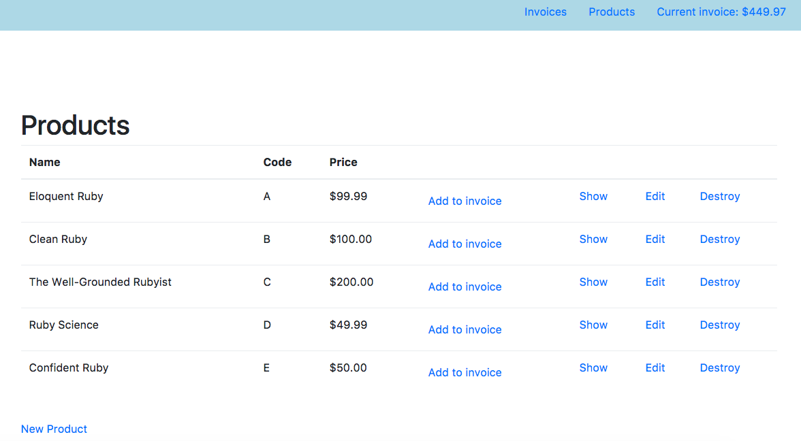
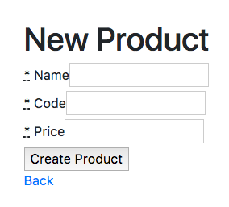
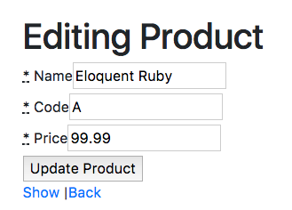
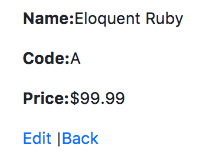
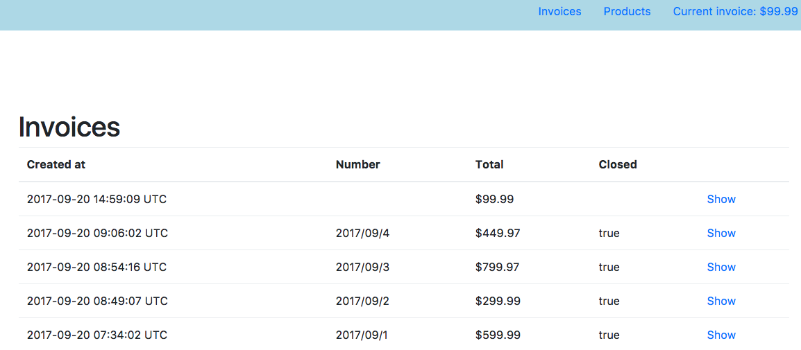
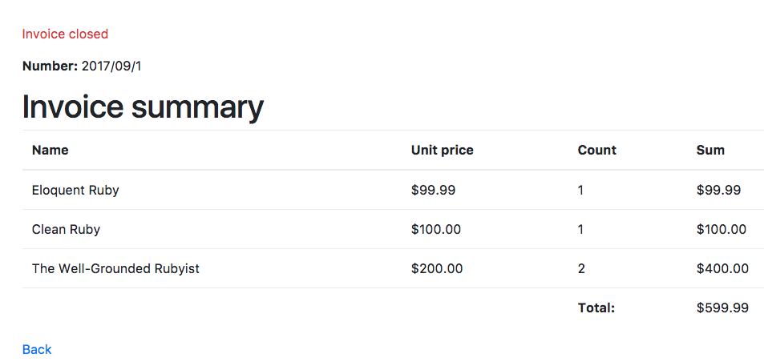
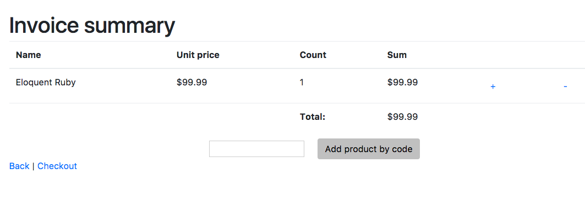
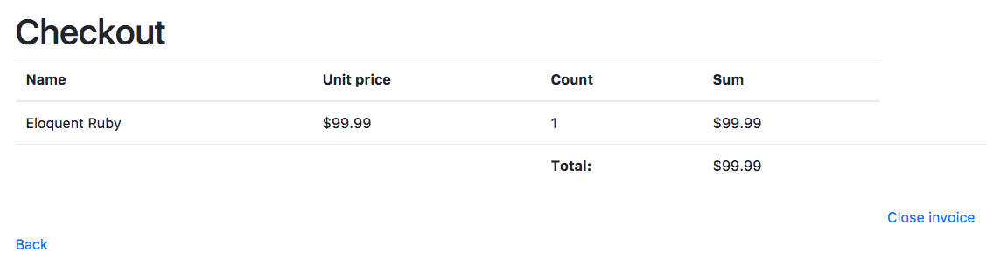

# Simple invoice system Rails app

The task is to prepare simple bookshop invoicing system. You can use provided template, places with missing code are marked with comments `# TODO`. You can also provide complete solution by creating project from scratch. 

Template provides all needed model and controller declarations, including empty controller methods.
Template doesn't include any views, migrations, tests and services, although example folder structure for those is provided.

___

In overall, system should consist of:

- invoice preparation (basket-like feature)
- invoice summary screen
- invoice checkout feature
- previous invoices list
- invoice details screen for previous invoices
- product management

# Products:

Product management should be done in CRUD fashion. Things to be done include:

```
➤ View list of all products in database.
➤ View details of choosen product.
➤ Add new product feature.
➤ Edit existing product feature.
➤ Delete product (with 'Are you sure' prompt) feature. Remember that old invoices that include deleted products should be still showed correctly!
➤ Application root should be product list.
➤ Link to product list in navigation.
➤ Link to add product to invoice on product list.
➤ Initial product list.
➤ Validations for product name and code uniqueness.
```

Product list view:



New product form:



Edit product form:



Product details view:



Initial product list should include:

|Name|Code|Price|
|---|---|---|
|Eloquent Ruby|A|$99.99|
|Clean Ruby|B|$100.00|
|The Well-Grounded Rubyist|C|$200.00|
|Ruby Science|D|$49.99|
|Confident Ruby|E|$50.00|

# Invoice preparation

System should allow cashier to add items to current invoice. If there is no current invoice then one should be created. Products added to current invoice should be stored in database and current invoice ID should be stored in user session.

Adding items to invoice can resemble 'basket' feature available in almost every internet store.

Things to do include:

```
➤ Storing current invoice products in database.
➤ Storing current invoice id in session.
➤ Dynamic creation of new invoice when adding first product.
➤ Adding item by clicking 'add item to current invoice' button on products list (visible on screen in 'Products' section).
➤ Adding item by inputing product code in text box visible in 'current invoice' screen (visible below in 'Current invoice screen' section).
➤ Adding items should be implemented as a CQRS service.
```

Internally invoice addition should use services (CQRS pattern, check out [https://www.netguru.co/blog/service-objects-in-rails-will-help](https://www.netguru.co/blog/service-objects-in-rails-will-help) to learn more about CQRS).

# Invoices

Things to do include:

```
➤ Invoices list view.
➤ Invoice details view (with information if invoice is closed).
```

Invoice list:



Invoice details:



# Current invoice screen

Things to do include:

```
➤ Current invoice screen should contain all products added to basket, unit product prices, counts, product overall price (product price multiplied by count) and total price of invoice.
➤ Products added to current invoice multiple times should be showed in aggregated fashion.
➤ Each product should contain +/- buttons to change count of these products in current invoice
➤ Screen should contain field for adding products by code.
➤ Current invoice state should be saved to database
➤ Current invoice id should be stored in user session
➤ Adding and substracting items should be implemented as a CQRS service.
```

Current invoice screen:



# Summary and checkout

Things to do include:

```
➤ Product summary screen should contain all products added to basket, unit product prices, counts, product overall price (product price multiplied by count) and overall price of invoice.
➤ Button to close to generate invoice number and close invoice. Closing invoice should disable further modification. Closing invoice shouldn't be possible without assigning it invoice number.
➤ Invoice number generated on checkout should include year and month code and should look like "YY/MM/number_this_month". You can use query object (CQRS pattern).
➤ Checkout process should be implemented by using services (CQRS pattern).
```

Checkout screen:



# Automatic testing

Project should include automatic unit tests for products CRUD, adding product to current invoice service and checkout service.

Example test can include:

```
➤ Adding items when there is no invoice should create new invoice.
➤ Adding items when there current invoice is already closed should create new invoice.
➤ Adding items when there current invoice should only add items to invoice.
➤ Adding items when there already the same item in invoice should change item count.
➤ Substracting items should change count of item in invoice and destroy item if count equals zero.
➤ Closing invoice assigns number.
➤ Closing empty invoice is not possible.
➤ Creation of invalid product (duplicate name, empty code, nagative price) is impossible.
```

# Overcommit and RuboCop

In our projects we often use **overcommit** to run Git hooks. Git hooks are commands defined to run before execution of git commands (such as `git commit`) and can be used to automatize some processes.

Project template provides file `.overcommit.yml` which includes two hooks configured:

* pre-commit hook running RuboCop
* pre-push hook running RSpec (you can change this to minitest or other testing framework you use)

Overcommit must be installed first by running `gem install overcommit`.

To learn more about overcommit go to [https://github.com/brigade/overcommit](https://github.com/brigade/overcommit).

**RuboCop** is static code analyzer (linter) that helps to provide code with highest quality possible. After overcommit installation it will be run before every `git commit`. It can also be run manually by simply typing `rubocop` in command line while in the project folder.

RuboCop configuration is provided in `.rubocop.yml` file. Remember that you have to install rubocop first if you never used it before - to install it run `gem install rubocop`.

To learn more about RuboCop please go to [https://github.com/bbatsov/rubocop](https://github.com/bbatsov/rubocop).

___

# Additional points

- Use SLIM as a template engine.
- Use decorator to show prices (such as Draper).
- Prefer only REST methods as public controller methods (index, show, new, create, edit, update, delete).
- To prepare automatic testing use RSpec.

### Currency conversion
- Add possibility to do currency conversion for invoice total.
- Currency conversion should be available in checkout summary screen.
- There should be possibility to input 3 letter currency code. If there's no code provided invoice total should be showed in every currency available.
- Current conversion rates should be downloaded from external API available on [http://fixer.io](http://fixer.io).

### Change
Add field to input money value gave by the customer so application can calculate change. Change can be calculated by clicking button or dynamically when user inputs value with help of some simple JavaScript.

___

# Suggestions

* Don't worry if you can't do everything and send us parts you were able to solve, don't spend too much time on this
* If you're not familiar with CQRS you can provide your own solution. We are aware that there are multiple solutions to get this application working and we just wanted to show you how we usually work.
* Don’t worry too much about front-end but if you want to make a good impression you can use something like Bootstrap.
* Make sure README includes all required steps to run your app on Unix-like environment.
* You can use any PostgreSQL or SQLite as database.

# Submitting solution

Clone this repository and create local repo on your machine. Ready application should be delivered as zip file. Please DON'T post solution as a public repo anywhere.

Before you send a solution add missing tests and make sure all tests are green.

Working application should be deployed to Heroku and link to app should be included with your solution. To learn more about application deployment to Heroku please go to [https://devcenter.heroku.com/articles/getting-started-with-rails5](https://devcenter.heroku.com/articles/getting-started-with-rails5). Remember to include Procfile - it's use on Heroku is optional, but highly recommended.

___

# Things to think about

Here are few additional things to think about. These aren't additional tasks and they shouldn't be part of your solution.

* How would you implement possibility to change products number in invoice summary by inputing product count.
* Is invoice numbering thread safe in your implementation and why?
* How would you change invoices numbering system so it uses all numbers and letters in english alphabet instead of YY/mm/number format.